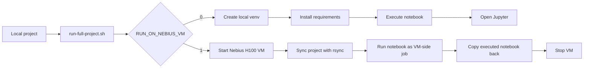

# PPO Glass-Box LLM

[](https://www.python.org/)
[](https://jupyter.org/)
[](https://pytorch.org/)
[](https://huggingface.co/docs/transformers)
[](LICENSE)

A compact, rerunnable PPO/RLHF-style notebook for seeing the full training loop instead of hiding it behind a trainer abstraction. The notebook uses GPT-2 and transparent reward functions so rollout, KL penalty, GAE, PPO clipping, value learning, beta sweeps, and exercise dashboards are easy to inspect.

The current profile is tuned for the Nebius H100 VM run: longer completions, 5-seed exercise sweeps, confidence intervals, and copied-back notebook outputs.

## Highlights

| Area | What is included |
| --- | --- |
| PPO internals | Rollout, old/new logprobs, clipped surrogate, KL-to-reference penalty, entropy, value loss |
| Advantage estimation | GAE with lambda sweep and critic ablation |
| Stability controls | Shuffled minibatches, value clipping, optional reward whitening, response masks |
| Diagnostics | Reward, KL, clip fraction, approx KL, ratio variance, value loss, value clip fraction |
| Exercises | `clip_eps`, GAE lambda, beta versus reward scale, PPO epochs, critic removal |
| Reproducibility | 5-seed compact sweeps with 95% confidence intervals |
| Automation | Local run mode plus Nebius VM start, sync, execute, copy-back, and shutdown |

## Run Flow



## Files

| Path | Purpose |
| --- | --- |
| `ppo_glassbox_llm-final.ipynb` | Main executed notebook |
| `requirements.txt` | Python dependencies |
| `run-full-project.sh` | Local runner and Nebius VM runner |
| `.env.example` | Environment template |
| `.gitignore` | Local secrets/cache/output exclusions |
| `LICENSE` | MIT license |

## Quick Start

Create a local `.env` file and add your Hugging Face token:

```bash
cp .env.example .env
```

```bash
HF_TOKEN=your_huggingface_token_here
```

Run the full project locally:

```bash
./run-full-project.sh
```

The local runner creates `.venv`, installs `requirements.txt`, loads `.env`, executes `ppo_glassbox_llm-final.ipynb`, then opens Jupyter Notebook in the browser.

Useful local overrides:

```bash
JUPYTER_PORT=8890 ./run-full-project.sh
NOTEBOOK_TIMEOUT=7200 ./run-full-project.sh
EXECUTE_ONLY=1 ./run-full-project.sh
```

## Nebius H100 Run

Use this mode for the full H100 profile:

```bash
RUN_ON_NEBIUS_VM=1 \
NEBIUS_INSTANCE_ID=computeinstance-e00w0xbw74zqy24mf7 \
VM_SSH_USER=sapirpirski \
NOTEBOOK_TIMEOUT=14400 \
./run-full-project.sh
```

You can put the same variables in `.env`. Command-line variables override `.env`.

The VM runner will:

1. Start the Nebius VM.
2. Detect the current public IP.
3. Wait for SSH.
4. Install minimal OS prerequisites if needed.
5. Sync the project to `~/ppo-glassbox-llm`.
6. Execute the notebook as a detached VM-side job.
7. Poll the remote log during long quiet notebook cells.
8. Copy the executed notebook back locally.
9. Stop the VM.

Useful VM overrides:

```bash
VM_STOP_AFTER=0             # leave the VM running after the run
VM_COPY_BACK=0              # skip copying the notebook back
VM_SSH_HOST=1.2.3.4         # manual IP override if auto-detection fails
VM_WORKDIR=ppo-glassbox-llm
VM_NOTEBOOK_POLL_SECONDS=60
```

## Hardware Profile

| Setting | H100 default | Local/CPU suggestion |
| --- | ---: | ---: |
| `batch_size` | `32` | `16` |
| `gen_len` | `32` | `16` |
| `mini_batch_size` | `16` | `8` or `16` |
| `iters` | `100` | `60` |
| `EXERCISE_SEEDS` | `5 seeds` | `1 seed` |

A GPU is not strictly required, but the checked-in notebook outputs were generated on the Nebius H100 profile.

## Verified Run

Last full run: July 4, 2026 on Nebius `gpu-h100-sxm`, `1gpu-16vcpu-200gb`.

| Item | Value |
| --- | --- |
| VM | `violet-xerinae-instance-5` |
| Instance ID | `computeinstance-e00w0xbw74zqy24mf7` |
| Python | `3.12` |
| Core packages | `torch 2.12.1`, `transformers 5.13.0`, `notebook 7.6.0`, `ipykernel 7.3.0` |
| Notebook profile | `batch_size=32`, `gen_len=32`, `mini_batch_size=16`, `iters=100` |
| Result | 17/17 code cells executed, no error outputs, notebook copied back locally |
| Final VM state | `STOPPED` |

## Notebook Notes

- The notebook uses `gpt2` by default.
- The final exercise section reruns multi-seed sweeps and generates modern summary dashboards with mean/CI tables and error bars.
- EOS/missing-EOS is still logged as a diagnostic, but the saturated missing-EOS chart is intentionally omitted from the main visuals.
- `.env` is ignored by git so the Hugging Face token is not committed.

## References

- [Hugging Face TRL](https://github.com/huggingface/trl) for PPO/RLHF trainer conventions.
- [OpenRLHF](https://github.com/OpenRLHF/OpenRLHF) for modern RLHF training controls and diagnostics.
- [DeepSpeed-Chat](https://github.com/microsoft/DeepSpeedExamples/tree/master/applications/DeepSpeed-Chat) for RLHF pipeline structure.
- [PPO paper](https://arxiv.org/abs/1707.06347).
- [GAE paper](https://arxiv.org/abs/1506.02438).

## License

MIT. See [LICENSE](LICENSE).
